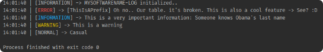

# JLogManager

A logging library for java

## Maven Installation

```xml

	<repositories>
		<repository>
		    <id>jitpack.io</id>
		    <url>https://jitpack.io</url>
		</repository>
	</repositories>
	<dependency>
	    <groupId>com.github.queerzard</groupId>
	    <artifactId>ALogManager4J</artifactId>
	    <version>-c2c3d53157-1</version>
	</dependency>
```

## Used libraries

- [lombok](https://projectlombok.org/)
- [JEvent](https://github.com/SebyPlays/JEvent)
- [ColoredConsole](https://github.com/SebyPlays/ColoredConsole)

## Usage/Examples

Log stuff:

```java
import com.github.sebyplays.logmanager.utils.Logger;

public class LogManagerTest {

    public static void main(String[] args) {
        Logger logger = new Logger("MySoftwareName");
        logger.name("ThisIsAPrefix").error("Oh no.. Our table. it's broken. This is also a cool feature -> {}", "See? :D");
        logger.info("This is a very important information: {}", "Someone knows Obama's last name");
        logger.warning("This is a warning");
        logger.normal("Casual");
    }

}
```

Output:


